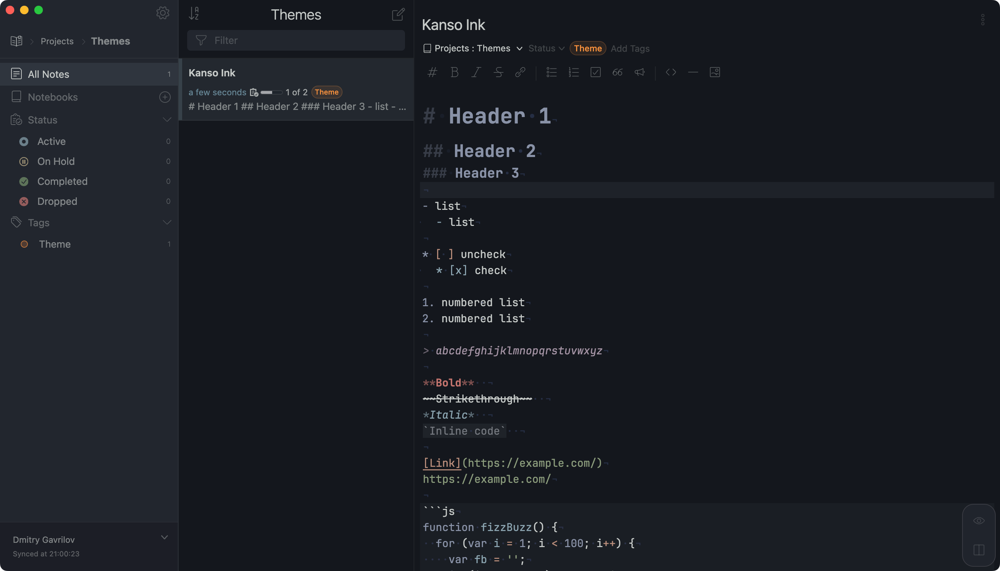

# Kanso Ink Dark UI theme for Inkdrop

## Screenshot



## Features

- WCAG 2.1 AA compliant for comfortable code readability
- Comfortable contrast levels for reduced eye strain

## Installation

```sh
$ ipm install kanso-ink-dark-ui

# Additional
$ ipm install kanso-ink-syntax
$ ipm install kanso-ink-preview
```

## Related

* [dgavrilov/kanso-ink-syntax](https://github.com/dgavrilov/kanso-ink-syntax)
* [dgavrilov/kanso-ink-preview](https://github.com/dgavrilov/kanso-ink-preview)

## Credits

- [webhooked](https://github.com/webhooked/kanso.nvim) for the original Kanso Neovim theme
- [rebelot](https://github.com/rebelot/kanagawa.nvim) for the original Kanagawa Neovim theme

## License

This project is licensed under [BSD 3-Clause](LICENSE) license.
